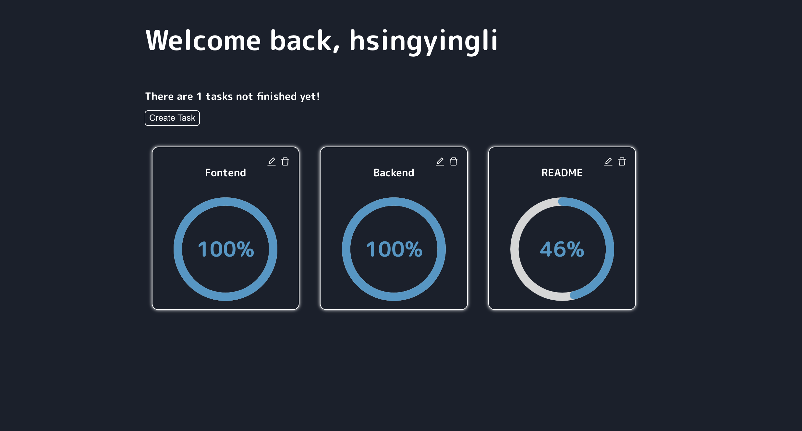

# Task Manager Web App (practice) 
> learn by doing : protect route, persist login, custom hooks, auth, axios
---


---
## Stack 
- [React](https://reactjs.org/) : A JavaScript library for building user interfaces 
- [Emotion](https://emotion.sh/docs/introduction) : Emotion is a library designed for writing css styles with JavaScript
- [MongoDB](https://www.mongodb.com/) : MongoDB is a document database with the scalability and flexibility
- [Express](https://expressjs.com/) : Express is a minimal and flexible Node.js web application framework

---
## Project structure 
```
.
├── README.md
├── backend
│   └── src
│       ├── controller     
│       ├── middlewares  
│       ├── models
│       ├── routes
│       └── server.js
└── frontend
     └── src
         ├── api 
         ├── components
         ├── context
         ├── hooks
         ├── pages
         ├── styles
         └── lib
```

---
## Access Token and Refresh Token 
- access token is stored in memory and expire in 30s 
- refresh token is stored in http only cookie and expire in 30d

---
## Functionality 
- create, detete, update tasks (description, progress)
- login, register, persist login(refresh token has not expired),
- theme 
